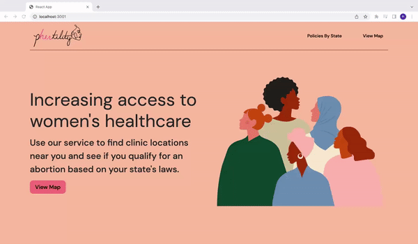

# phertility

https://phertility.netlify.app

## Description
Web-based application that uses a user's current location to connect them to local abortion clinics and provide live data on state policies 

## Demonstration
 

*View Backend Code [here](https://github.com/ranadubauskas/phertility-backend)

## Features
- Gets user's current location
- Displays abortion clinics and birth control services on map within a 1000 mile radius
- Custom Google Maps markers that display location name, address, and rating of clinic on hover
- Custom legend with map marker explanations
- Organize clinics on map by their marker color (blue for birth controls services and pink for abortion clinics)
- Allows user to lock location info on screen by clicking the maps marker
- Direct users to live state policy page from the location of abortion clinc clicked
- Search feature that filters states
- Display live data including state policies, number of clinics, percentage of pregnancies aborted, and total abortions in past year for each state

## Built With
- React
- Firebase
- Node
- Python (Web Scraping)
- Google Maps API
- Google Places API
- HTML
- CSS
- Bootstrap

## Future Updates
- Allow users to look up abortion clinics based on a city of their choice
- Implement calculator based on user's age, location, insurance, and pregnancy term to display which abortion clinics are available
- Give users a route & directions to the nearby clinics
- Implement form to send user updates for when abortion policies change 

## Contributors
  - **Rana Dubauskas** - *Developed the app* -
    [@ranadubauskas](https://github.com/ranadubauskas)
  - **Kai Dubauskas** - *Developed the app*  - [@kaidubauskas](https://github.com/KaiDubauskas)
  - **Vivaan Nanavati** - *Developed the app* - [@vivaannanavati123](https://github.com/vivaannanavati123)
  - **Anjali Kota** - *Developed the app* - [@anjalikota27](https://github.com/Anjalikota27)

*Project completed in under 36 hours for VandyHacks IX 2022 & won prize for Best Use of Google Cloud. View DevPost [here](https://devpost.com/software/phertility)

